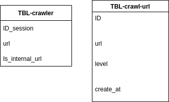

# assignment

Challenge 1 :

The problem requirement check input string correctly format. The first time we need to delete the unimportant character , just contain the important character ('(',')','['.']','{','}')
```
      a = list(filter(lambda x : x in ['{','}','(',')','[',']'],list(string)))
```
Example

```
  1222(}dsdcdcd{}cdcdsdc => (}{}
  342342()scasda() => ()()
```
After that we observe the pattern we can see the problem we have some consider :
   - The incorrect patterns have the wrong close bracket " ')' '}' ']'" , the wrong close bracket is mean before it always have a open bracket same type
Example of wrong close bracket:
```
  {) => It's an incorrect pattern because the close bracket second index is not the same type with open bracket first index
  ((])) = > It's an incorrect pattern becuase don't have any open bracket before the close bracket index third is same type
```
  - The incorrect pattern have case wrong open bracket " '(' '{' '['" that mean don't have a close bracket same type to close it.
  
  
  Example of wrong close bracket:
```
  {) => It's an incorrect pattern , The example is same example wrong pattern above but the example we can understand the first bracket don't have any bracket close it so the example is incorrect pattern
  [()()[] => The fisrt open bracket don't have any bracket close it so the pattern is wrong
```
In conclusion, the above consider is the same reason it 's different perspective about use close bracket or open bracket. The wrong pattern is when open bracket don 't have any after bracket close it and the close bracket don't have any bracket before open it . the solution of the problem I use a stack, the stack will push all open bracket into it and loop to the string if the current index is close bracket , just check the top element of stack is the bracket same type or it 's not same type return false and after iterator the string we just check the len of stack because the length of stack is not zero , that mean don't have any close bracket fit it.
```

```
Challenge 2


The requirements:
Python3.6 
Postgres 
nginx 
Install
To convient , I install Postgres by docker 
```
docker run --name postgres-sql -e POSTGRES_PASSWORD=123456 -e POSTGRES_USER testdb -e POSTGRES_DB=crawlerDB -p 5432:5432 -d postgres 
```
 Database
 


I decide the database like the diagram above, Because the input of client is the url and level , in the url of website have so much href both the href on internal website and href of external website. I just forcus crawl the internal url because If i forcus the external url , the infomation crawl maybe so much information.

<b>The architecture</b>: client -> nginx -> gunicorn -> flask(python)
Some consider I implement in the project:
- I design the crawler like BFS algorithm and just crawl continue the internal href.
- Design safe thread to avoid the GIL in python, every thread request crawl the URL I just make sure don't happen request don't success so I design retry pattern and retry 3 times for every request failded. you can check the source code here : ./Challenge2/crawler/app/crawler.py
- Make every url don't crawl more one times, I check save the url into the set datatype to make sure just every url is unique.
- Every deploy the server will generator the debug log and its name is crawler.log
- the Nginx I design the custom log conatiner information about uri , request , agent ...

<b>Build</b>:
```
      pip install -r requirements.txt
      sudo cp Challenge2/crawler/default /etc/nginx/sites-enabled
      sudo systemctl restart nginx.service
      cd Challenge2/crawler/app
      ./migrate.sh
      ./run.sh
```
## API 
  - POST :  127.0.0.1:80/api/v1/crawler
  - Request
    - Content-type	: application/json
    - Body 
      ```
            {
	            "url": String,
	            "level": Int
            }
      ```
   - Response
     - Http code : 200 
Furure work:
      There is simple crawler so more inconvenience, below is some the idea to upgrade the application:
   - Deploy the application use docker 
   - Distributed crawl to achieve high performance
   - Redundant content , use hasher or checksum help dectect deuplication
   - Cache DNS Resolverm If many request from client go to the website will blocked 
 
 Above all my implement to complete the asignment, Any inconvenient please contact me with the email: lamnguyent7@gmail.com
